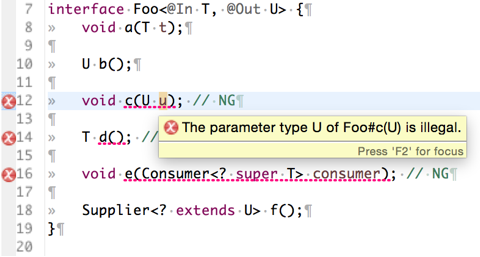

Variance4J
============================

__Variance4J__ provides the __declaration-site variance annotations for Java like in C#__.



How to Use
----------------------------

1. Write `@In` and `@Out` in your code.
2. Compile your code with _Variance4J_.

### javac

```
javac -cp path/to/variance4j.jar Foo.java 
```

### Eclipse

1. Check `Enable project specific settings` in `Properties > Java Compiler > Annotation Processing`.
2. Ensure `Enable annotation processing` is checked in `Properties > Java Compiler > Annotation Processing`.
3. Check `Enable project specific settings` in `Properties > Java Compiler > Annotation Processing > Factory Path`.
4. Add _variance4j.jar_ to `Properties > Java Compiler > Annotation Processing > Factory Path`.
5. Add _variance4j.jar_ to `Properties > Java Build Path > Libraries`.

Achieved and Not Achieved
----------------------------

### Achieved

It can report the errors at compile time if the return type or the parameter types of the methods are illegal.

```java
interface Foo<@Out T> {
    void bar(T t); // Error

    void baz(Consumer<? super T> consumer); // OK
}
```

### Not Achieved 

It __cannot__ eliminate _Wildcards_: `? extends` and `? super`. They are still necessary to realize variances in Java even if you use `@In` and `@Out`.

```java
Foo<Cat> cat = ...;
Foo<Animal> animal = car; // Error
```

```java
Foo<Cat> cat = ...;
Foo<? extends Animal> animal = car; // OK
```

For What?
----------------------------

It is difficult to use _Wildcards_ correctly. For example, the following code has a problem.

```java
interface Foo {
    Comparator<Integer> getComparator();
}
```

It is impossible to declare `interface Bar extends Foo` with `Comparator<Number> getComparator()` with the `Foo` above. The better one is the below.

```java
interface Foo {
    Comparator<? super Integer> getComparator();
}
```

With `@In` and `@Out`, we never wonder which to use `? super` or `? extends`. __The following simple rule is useful__ to decide which _Wildcard_ to apply.

- If declared as `@In`, use `? super`.
- If declared as `@Out`, use `? extends`.
- If declared without `@In` nor `@Out`, neither `? super` nor `? extends` is necessary.

```java
/* Declaration-site */
// Contravariant for T, Covariant for R
interface Function<@In T, @Out R> {
        R apply(T t);
}
```

```java
/* Use-site */
// Variables
Function<? super String, ? extends Number> function = ...;

// Parameter Types
void foo(Function<? super String, ? extends Number>) { ... }

// Return types
Function<? super String, ? extends Number> bar() { ... }
```

If _Variance4J_ provided just the annotations, `@In` and `@Out`, it would be hard to declare types of methods legally. _Variance4J_ provides the annotation processor to check the types so that programmers never declare illegal methods with `@In` and/or `@Out`.

Requirements
----------------------------

- Java 8

License
----------------------------

[The MIT License](LICENSE).

References
----------------------------

- [Exact rules for variance validity - Eric Lippert's Blog](http://blogs.msdn.com/b/ericlippert/archive/2009/12/03/exact-rules-for-variance-validity.aspx)
- [Covariance and contravariance (computer science) - Wikipedia](http://en.wikipedia.org/wiki/Covariance_and_contravariance_%28computer_science%29)
